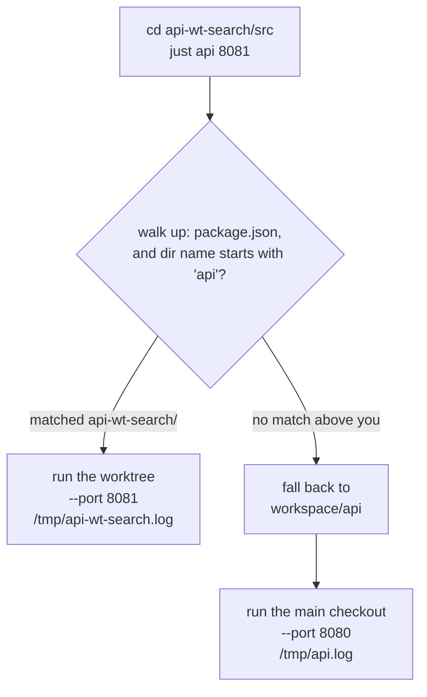
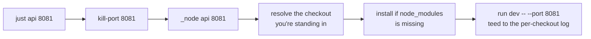
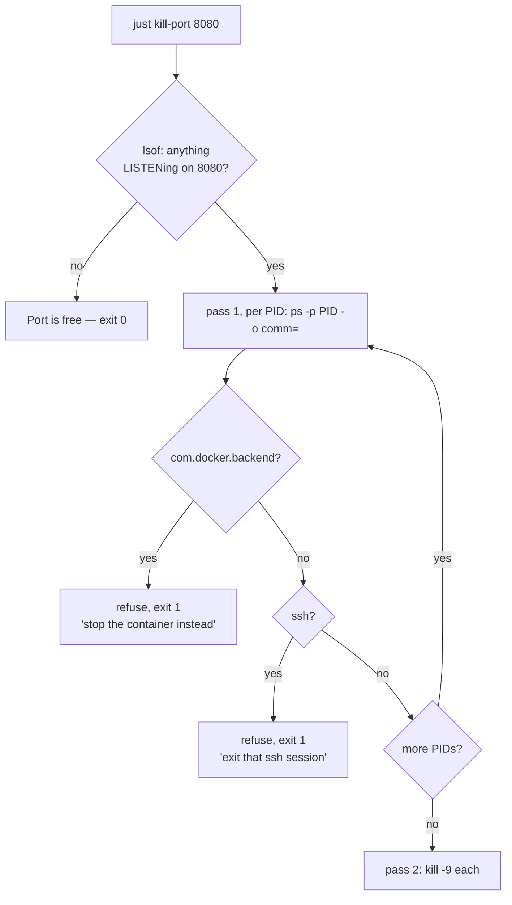

# workspace-justfile

One `justfile` at the root of a multi-repo workspace, so every service starts the
same way, from anywhere — including from a git worktree, which runs *that*
checkout rather than the main one.

The problem it solves: a workspace with several sibling repos accumulates a
different incantation per service. One is on a port something else is already
holding, one has three checkouts and you need a specific one, and all of them
assume you're standing in exactly the right directory. That knowledge ends up in
a README nobody re-reads, or in one person's head.

```bash
just                                  # what can I run?
just api                              # main checkout, :8080
cd api/src && just api                # same thing — no justfile down here, none needed
cd api-wt-search && just api 8081     # the worktree's code, :8081, side by side
```

This repo is the pattern, not a package: copy the `justfile`, rename the
recipes, delete what you don't need. The sibling repos it references are yours
to supply.

## Layout

```
workspace/
  justfile             <- the only entry point
  api/                 TypeScript HTTP service    just api        :8080
  api-wt-search/       git worktree of api/       just api 8081   :8081
  worker/              TypeScript queue worker    just worker     :8085
  worker-wt-retries/   git worktree of worker/    just worker 8086
  web/                 Vite + React frontend      just web        :3000
```

Every recipe takes a port, precisely so a worktree can come up next to the
checkout already running.

## Try it

[`examples/workspace/`](examples/workspace) is that layout, runnable: three
zero-dependency stand-in services and this repo's justfile, imported unchanged.

```bash
cd examples/workspace/api    # the service folder, where you actually are
just api
curl 127.0.0.1:8080          # → {"service":"api","checkout":"api","port":8080}
```

Each service reports the checkout it was started from, so the worktree
walkthrough in its [README](examples/workspace/README.md) — two copies of the
same service on two ports — is something you can see rather than take on faith.

## Worktrees are the point

Long-lived branches are much nicer as worktrees than as `git checkout` churn —
but only if running them is as cheap as running the main copy. Two things make
that true here.

**Resolution walks up from where you stand.** Any directory inside a checkout
resolves to that checkout; anywhere else falls back to the one next to the
justfile.



The prefix match on the directory name is what makes `api-wt-search` count as
`api`; the `package.json` check is what stops a directory that merely starts with
the right letters. The log path is named after the *checkout*, so the two runs
don't overwrite each other's output.

**The port argument is what makes them coexist.** Leave it off in the worktree
and `just api` claims the same default :8080 — `kill-port` stops the copy running
from the main checkout, and the worktree takes over:

```console
$ cd api-wt-search && just api
Port 8080 is occupied by '…/node' (PID: 87960), killing...
```

That's the right default for the common case (you switched which branch you're
testing) and the reason a second port is one argument away rather than a second
recipe.

**The path is load-bearing.** Resolution finds a checkout by prefix-matching the
repo name, so a worktree parked somewhere else, or named anything else, will not
resolve. `just wt` puts it where the convention expects:

```bash
just wt api search        # worktree at api-wt-search/, on branch `search`
just wt-list              # every worktree of every repo in the workspace
```

## The patterns

### Bare `just` documents itself

```just
default:
    @just --list
```

Without a `default` recipe, running `just` with no arguments runs the *first*
recipe in the file. One line turns that footgun into a help screen — and makes
`just --list` the thing people actually use to discover what a workspace can do.

### A public recipe is a name plus a set of arguments

The mechanics live once, in a private helper. Public recipes are one-liners
composed from dependencies:

```just
api port="8080":    (kill-port port) (_node "api" port)
worker port="8085": (kill-port port) (_node "worker" port)
web port="3000":    (kill-port port) (_node "web" port)
```



Recipes prefixed with `_` are hidden from `just --list`, so the listing stays an
inventory of what you can run rather than a dump of implementation.

The payoff isn't elegance, it's diffs. When the startup sequence changes — a new
check, a different log path — it changes in one place and every service inherits
it. Adding a service is one line.

### Run from anywhere

`just` gives you two directory functions, and the difference between them is the
whole trick: `justfile_directory()` is where the file lives, `invocation_directory()`
is where *you* were standing.

```just
from="{{ invocation_directory() }}"
target=""
d="$from"
while [[ "$d" != "/" ]]; do
    if [[ -f "$d/package.json" && "$(basename "$d")" == {{ dir }}* ]]; then
        target="$d"
        break
    fi
    d="$(dirname "$d")"
done
if [[ -z "$target" && -d "{{ root }}/{{ dir }}" ]]; then
    target="{{ root }}/{{ dir }}"
fi
```

Recipes that only use `justfile_directory()` assume you're at the workspace root.
In practice you're already inside the repo you want to start, because you were
just editing it — and increasingly that's a worktree of it.

### Say what to do, not just what is wrong

```just
if [[ -z "$target" ]]; then
    echo "[just {{ dir }}] no {{ dir }} checkout here or at {{ root }}/{{ dir }}"
    echo "[just {{ dir }}] fix: clone it next to this justfile, or run from inside it"
    exit 1
fi
```

Every failure a recipe can produce is one someone will hit at 9am on their first
day. The first line is the error; the second is the difference between a
ten-second fix and a Slack message. Same for the guards in `kill-port` — each one
prints the command you actually wanted.

### `*args` pass-through

```just
stack *args="up -d --wait":
    @cd {{ root }}/stack && docker compose {{ args }}
```

One recipe covers the whole compose surface — `just stack`, `just stack ps`,
`just stack down -v` — instead of a wrapper recipe per subcommand that always
lags behind what you actually type. Point it at a `stack/` directory holding
your own compose file; the example workspace doesn't ship one.

### Mirror the log to a fixed path

```just
log="/tmp/$(basename "$PWD").log"
{{ pm }} run dev -- --port {{ port }} 2>&1 | tee "$log"
```

You still watch the run in the terminal, and anything else — another pane, an
editor, a script grepping for a stack trace — can read it without competing for
your scrollback. Naming it after the checkout keeps a worktree's run out of the
main one's log.

**Gotcha:** `cmd | tee` reports *tee's* exit status, so a service that died on
startup looks like a clean run. `set -o pipefail` (or `set -euo pipefail`) fixes
it. This bites in CI far more often than locally.

### `kill-port` that refuses to kill the wrong thing

The recipe everyone writes on day one, and the one that earns its comments.



Three things it has to get right:

```just
pids=$(lsof -tiTCP:{{ port }} -sTCP:LISTEN 2>/dev/null || true)
```

**Listeners only.** A bare `lsof -ti:PORT` also matches *client* sockets that
merely connect to that port — including dead ones parked in `CLOSED`. Stale
outbound connections then make a completely free port look occupied, and the
recipe kills something unrelated to "free" it.

```just
for pid in $pids; do
    name=$(ps -p "$pid" -o comm= 2>/dev/null || echo "unknown")
```

**One `ps` per PID.** `lsof` can return several PIDs, and `ps -p` accepts only
one. Passing the whole list makes `ps` fail, the name fall back to `unknown`, and
every guard below silently stop guarding — the failure mode is that the
protections quietly do nothing, which is worse than not having them.

**Check everything before killing anything.** The guards run in their own pass,
so a protected process on the port can't be reached by killing its neighbour
first:

```just
    if [[ "$name" == *com.docker.backend* ]]; then   # takes down the daemon and every container
    if [[ "$name" == "ssh" || "$name" == */ssh ]]; then  # drops the whole session, tmux and all
```

Docker publishes container ports through its own backend process, so `kill -9` on
what looks like "the thing on :5432" stops the entire daemon. An ssh
`LocalForward` also shows up as a listener, and killing it takes down the session
it belongs to — every shell and tmux pane inside it — while the forward itself
was never the problem. Both cases print what to do instead and exit non-zero.

The ssh case has a second half worth spelling out, because most forwards that
squat on a port aren't sessions at all — they're `ssh -f -N -L` tunnels, or a
tool's transport that inherited a `LocalForward` from a `Host` block. "Exit that
ssh session" is useless advice for those; there's nothing to exit. So the guard
prints the process's command line and checks for a controlling terminal:

```console
$ just kill-port 8080
Port 8080 is an ssh port-forward (PID: 32799), not a local service.
  ssh -f -N -L 8080:localhost:8080 devbox
No terminal attached — a background forward, not a session you're in.
If you don't need it:  kill 32799
```

It still refuses either way. Whether the forward *leads* anywhere is the obvious
next question and the guard deliberately doesn't try to answer it: ssh accepts
the local connection before it knows the far end is reachable, and from outside
the process a dead tunnel is indistinguishable from a live one to a server that
speaks second — which is most of them. I tested it; a forward to a live redis
and a forward to nothing look identical. A guard that gets that wrong kills live
tunnels, so it stays out.

## Checking it

```bash
just selftest
```

Starts a listener on a spare port, asserts `kill-port` reclaims it, and asserts
it no-ops on a free port. The docker and ssh guards are deliberately *not*
exercised live: a broken guard would take down the very thing the test would have
to put in its way.

## Notes

- Requires [`just`](https://github.com/casey/just) and `lsof`. `kill-port` is
  written against BSD/macOS `lsof`; the flags used are the same on Linux.
- The package manager is a variable — `PM=npm just api`, or change the `pm`
  default. Every service is started with `{{ pm }} run dev`, which is spelled
  the same for pnpm, npm, yarn and bun.
- Configuration is deliberately not this file's business. Recipes pick *which*
  checkout runs on *which* port; how a service reads its own settings is between
  it and its own config loader.
- `just --fmt` is unstable and will move comments away from the item they
  document. This file is formatted by hand.
- `just --evaluate` prints the resolved variables.

## License

MIT
